# VPC Networking: Cloud HA-VPN

This repository contains documentation and screenshots for completing the **Google Cloud Skill Boost** lab: **VPC Networking: Cloud HA-VPN**.

## Overview

HA-VPN (High Availability VPN) is a highly available IPsec VPN solution that enables secure connectivity between your on-premises network and your Google Cloud Virtual Private Cloud (VPC) network. HA-VPN provides a 99.99% service availability SLA when configured with two tunnels.

### Key Features

- **High Availability**: HA-VPN gateways have two interfaces, each with their own public IP address
- **Dynamic Routing**: Uses BGP (Border Gateway Protocol) for automatic route exchange
- **99.99% SLA**: Achieved when configured with two tunnels per gateway
- **Regional Resource**: HA-VPN is a regional per-VPC solution

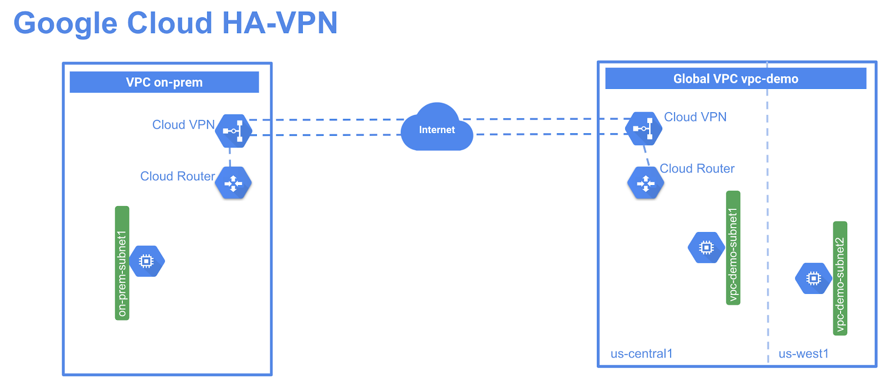

## What You'll Learn

- Configure high availability HA-VPN gateways
- Configure dynamic routing with VPN tunnels
- Configure global dynamic routing mode
- Verify and test HA-VPN high availability

## Prerequisites

- Basic knowledge of Google Compute Engine
- Familiarity with VPC networking concepts
- Access to Google Cloud Console with appropriate permissions
- Completion of "Networking 101" and "Multiple VPC Networks" labs (recommended)

---

## Lab Setup

This lab creates two VPC networks:

| Network | Purpose | Subnets |
|---------|---------|---------|
| `vpc-demo` | Cloud VPC network | `vpc-demo-subnet1` (10.1.1.0/24), `vpc-demo-subnet2` (10.2.1.0/24) |
| `on-prem` | Simulated on-premises environment | `on-prem-subnet1` (192.168.1.0/24) |

---

## Task 1: Cloud VPC Setup

### 1.1 Create VPC Network

Create a custom-mode VPC network called `vpc-demo`:

```bash
gcloud compute networks create vpc-demo --subnet-mode custom
```

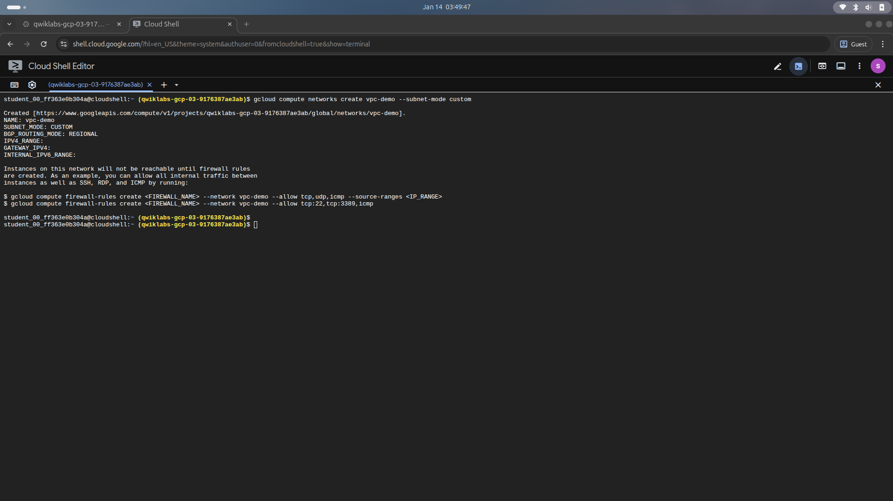

### 1.2 Create Subnets

Create subnet `vpc-demo-subnet1` in Region 1:

```bash
gcloud beta compute networks subnets create vpc-demo-subnet1 \
    --network vpc-demo \
    --range 10.1.1.0/24 \
    --region "REGION 1"
```


Create subnet `vpc-demo-subnet2` in Region 2:

```bash
gcloud beta compute networks subnets create vpc-demo-subnet2 \
    --network vpc-demo \
    --range 10.2.1.0/24 \
    --region "REGION 2"
```


### 1.3 Create Firewall Rules

Create a firewall rule to allow all internal traffic:

```bash
gcloud compute firewall-rules create vpc-demo-allow-internal \
    --network vpc-demo \
    --allow tcp:0-65535,udp:0-65535,icmp \
    --source-ranges 10.0.0.0/8
```

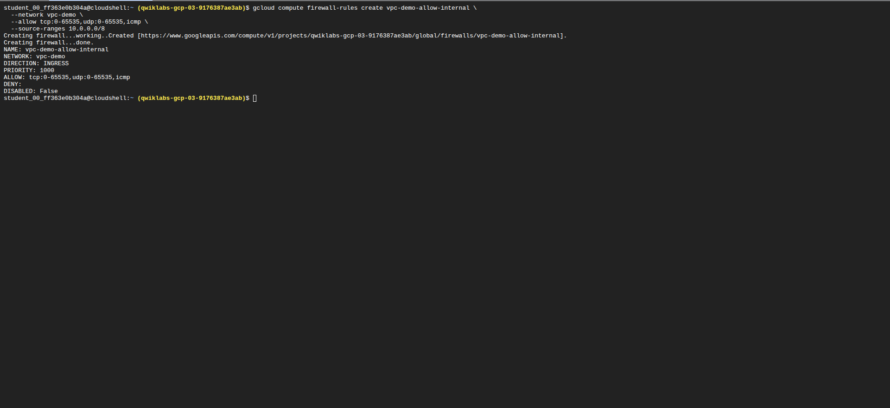

Create a firewall rule to allow SSH and ICMP from anywhere:

```bash
gcloud compute firewall-rules create vpc-demo-allow-ssh-icmp \
    --network vpc-demo \
    --allow tcp:22,icmp
```

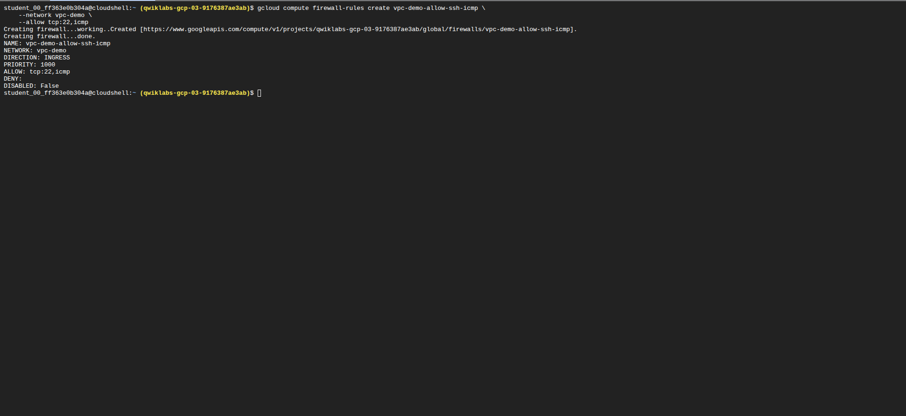

### 1.4 Create VM Instances

Create VM instance `vpc-demo-instance1` in Zone 2:

```bash
gcloud compute instances create vpc-demo-instance1 \
    --zone "ZONE 2" \
    --subnet vpc-demo-subnet1 \
    --machine-type e2-medium
```

Create VM instance `vpc-demo-instance2` in Zone:

```bash
gcloud compute instances create vpc-demo-instance2 \
    --zone "ZONE" \
    --subnet vpc-demo-subnet2 \
    --machine-type e2-medium
```

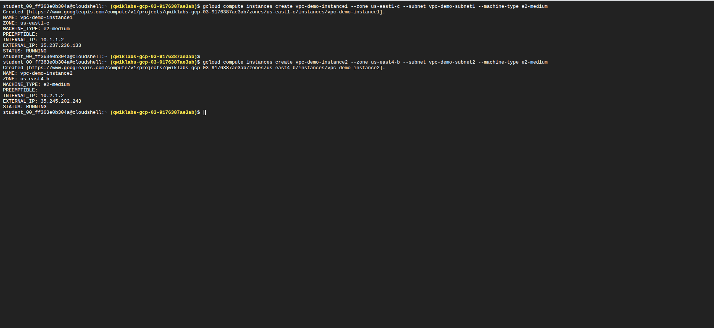

Verify instances in the Google Cloud Console:


---

## Task 2: Simulate On-Premises Setup

### 2.1 Create On-Premises Network

Create a VPC network called `on-prem` to simulate the on-premises environment:

```bash
gcloud compute networks create on-prem --subnet-mode custom
```

Create subnet `on-prem-subnet1`:

```bash
gcloud beta compute networks subnets create on-prem-subnet1 \
    --network on-prem \
    --range 192.168.1.0/24 \
    --region "REGION 1"
```

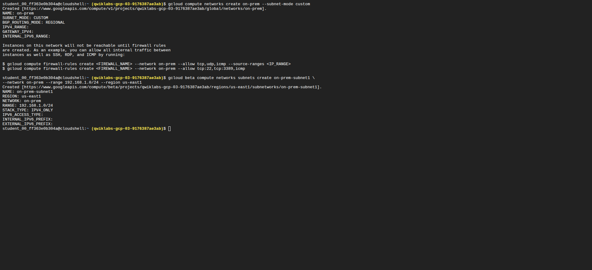

### 2.2 Create Firewall Rules

Create firewall rules for internal traffic and SSH/ICMP:

```bash
gcloud compute firewall-rules create on-prem-allow-internal \
    --network on-prem \
    --allow tcp:0-65535,udp:0-65535,icmp \
    --source-ranges 192.168.0.0/16

gcloud compute firewall-rules create on-prem-allow-ssh-icmp \
    --network on-prem \
    --allow tcp:22,icmp
```

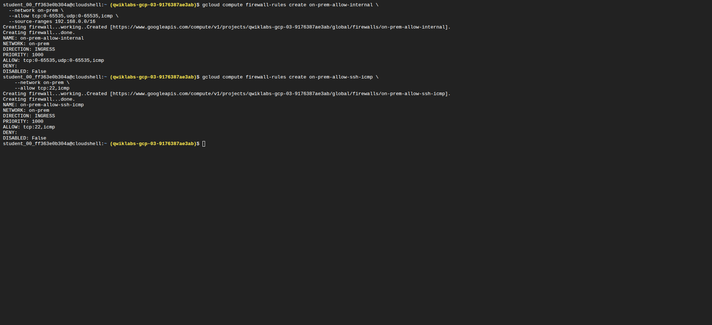

### 2.3 Create On-Premises Instance

Create the test instance in the on-prem network:

```bash
gcloud compute instances create on-prem-instance1 \
    --zone "ZONE 1" \
    --subnet on-prem-subnet1 \
    --machine-type e2-medium
```

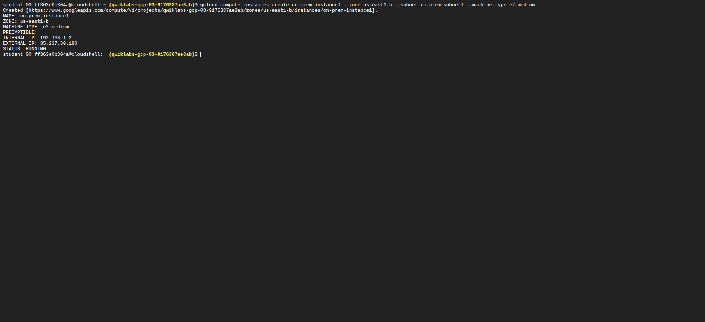

---

## Task 3: HA-VPN Setup

### 3.1 Create HA-VPN Gateways

Create an HA-VPN gateway in the `vpc-demo` network:

```bash
gcloud beta compute vpn-gateways create vpc-demo-vpn-gw1 \
    --network vpc-demo \
    --region "REGION 1"
```

Create an HA-VPN gateway in the `on-prem` network:

```bash
gcloud beta compute vpn-gateways create on-prem-vpn-gw1 \
    --network on-prem \
    --region "REGION 1"
```

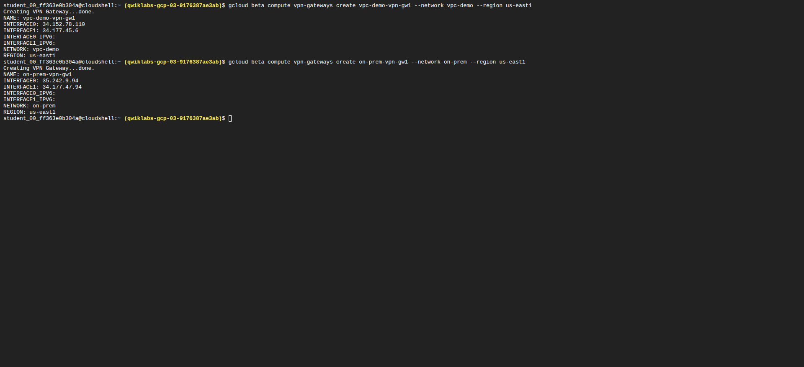

### 3.2 View VPN Gateway Details

Verify the VPN gateway configurations:

```bash
gcloud beta compute vpn-gateways describe vpc-demo-vpn-gw1 --region "REGION 1"
gcloud beta compute vpn-gateways describe on-prem-vpn-gw1 --region "REGION 1"
```

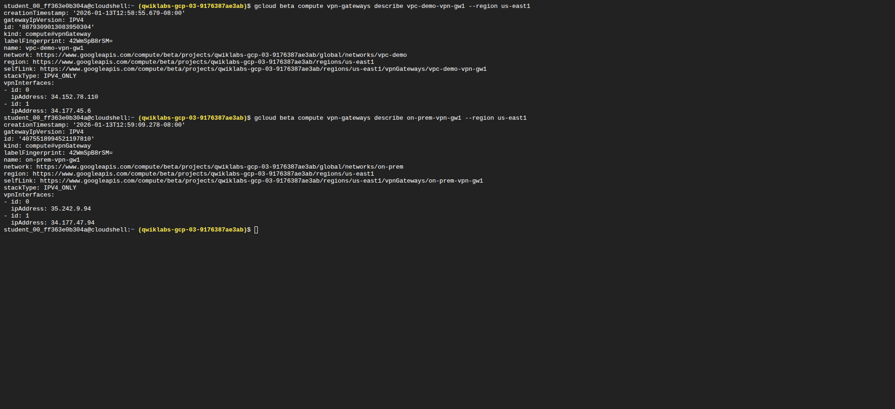

View VPN gateways in the console:

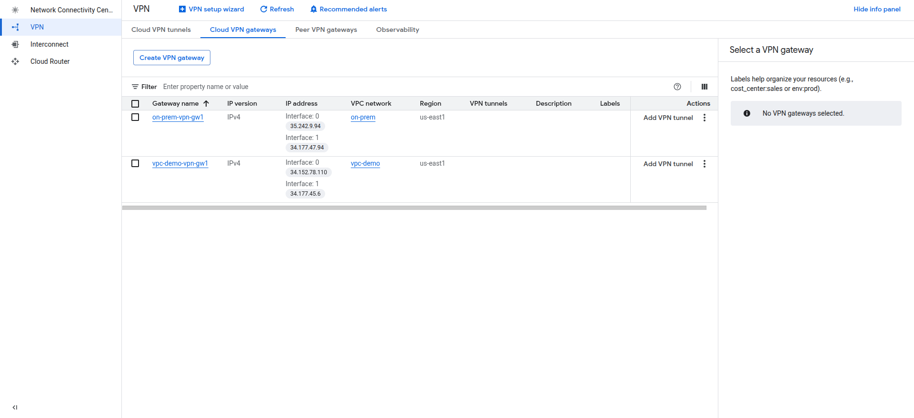


### 3.3 Create Cloud Routers

Create a Cloud Router in the `vpc-demo` network:

```bash
gcloud compute routers create vpc-demo-router1 \
    --region "REGION 1" \
    --network vpc-demo \
    --asn 65001
```

Create a Cloud Router in the `on-prem` network:

```bash
gcloud compute routers create on-prem-router1 \
    --region "REGION 1" \
    --network on-prem \
    --asn 65002
```

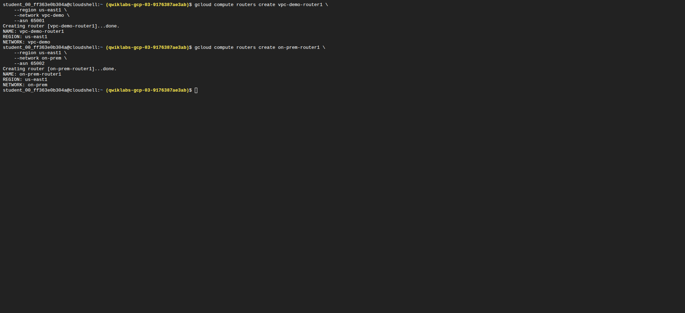

Verify Cloud Routers in the console:

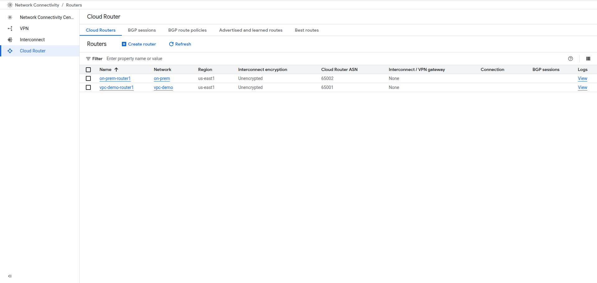

### 3.4 Create VPN Tunnels

> **Important**: For HA-VPN, you must create two tunnels per gateway. Interface 0 must connect to interface 0 on the remote gateway, and interface 1 must connect to interface 1.

Create tunnels in the `vpc-demo` network:

```bash
# Tunnel 0
gcloud beta compute vpn-tunnels create vpc-demo-tunnel0 \
    --peer-gcp-gateway on-prem-vpn-gw1 \
    --region "REGION 1" \
    --ike-version 2 \
    --shared-secret [SHARED_SECRET] \
    --router vpc-demo-router1 \
    --vpn-gateway vpc-demo-vpn-gw1 \
    --interface 0

# Tunnel 1
gcloud beta compute vpn-tunnels create vpc-demo-tunnel1 \
    --peer-gcp-gateway on-prem-vpn-gw1 \
    --region "REGION 1" \
    --ike-version 2 \
    --shared-secret [SHARED_SECRET] \
    --router vpc-demo-router1 \
    --vpn-gateway vpc-demo-vpn-gw1 \
    --interface 1
```

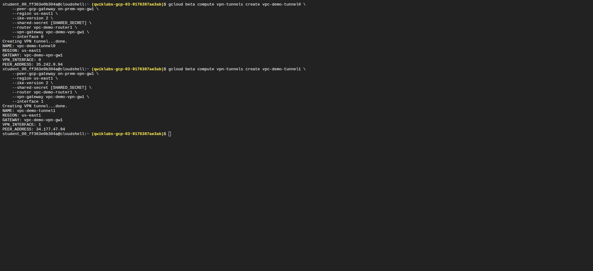

Create tunnels in the `on-prem` network:

```bash
# Tunnel 0
gcloud beta compute vpn-tunnels create on-prem-tunnel0 \
    --peer-gcp-gateway vpc-demo-vpn-gw1 \
    --region "REGION 1" \
    --ike-version 2 \
    --shared-secret [SHARED_SECRET] \
    --router on-prem-router1 \
    --vpn-gateway on-prem-vpn-gw1 \
    --interface 0

# Tunnel 1
gcloud beta compute vpn-tunnels create on-prem-tunnel1 \
    --peer-gcp-gateway vpc-demo-vpn-gw1 \
    --region "REGION 1" \
    --ike-version 2 \
    --shared-secret [SHARED_SECRET] \
    --router on-prem-router1 \
    --vpn-gateway on-prem-vpn-gw1 \
    --interface 1
```


View the established VPN tunnels (BGP not yet configured):

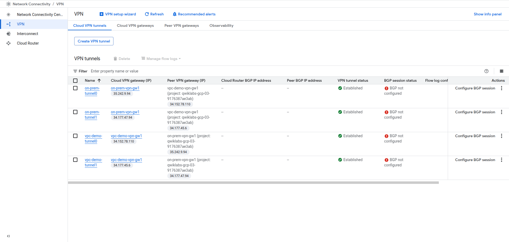

### 3.5 Configure BGP Peering

#### Configure BGP for vpc-demo-router1

Add router interfaces and BGP peers for both tunnels:

```bash
# Interface for tunnel0
gcloud compute routers add-interface vpc-demo-router1 \
    --interface-name if-tunnel0-to-on-prem \
    --ip-address 169.254.0.1 \
    --mask-length 30 \
    --vpn-tunnel vpc-demo-tunnel0 \
    --region "REGION 1"

# BGP peer for tunnel0
gcloud compute routers add-bgp-peer vpc-demo-router1 \
    --peer-name bgp-on-prem-tunnel0 \
    --interface if-tunnel0-to-on-prem \
    --peer-ip-address 169.254.0.2 \
    --peer-asn 65002 \
    --region "REGION 1"

# Interface for tunnel1
gcloud compute routers add-interface vpc-demo-router1 \
    --interface-name if-tunnel1-to-on-prem \
    --ip-address 169.254.1.1 \
    --mask-length 30 \
    --vpn-tunnel vpc-demo-tunnel1 \
    --region "REGION 1"

# BGP peer for tunnel1
gcloud compute routers add-bgp-peer vpc-demo-router1 \
    --peer-name bgp-on-prem-tunnel1 \
    --interface if-tunnel1-to-on-prem \
    --peer-ip-address 169.254.1.2 \
    --peer-asn 65002 \
    --region "REGION 1"
```

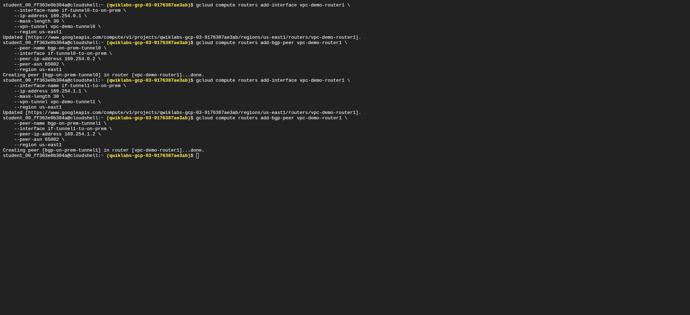

#### Configure BGP for on-prem-router1

```bash
# Interface for tunnel0
gcloud compute routers add-interface on-prem-router1 \
    --interface-name if-tunnel0-to-vpc-demo \
    --ip-address 169.254.0.2 \
    --mask-length 30 \
    --vpn-tunnel on-prem-tunnel0 \
    --region "REGION 1"

# BGP peer for tunnel0
gcloud compute routers add-bgp-peer on-prem-router1 \
    --peer-name bgp-vpc-demo-tunnel0 \
    --interface if-tunnel0-to-vpc-demo \
    --peer-ip-address 169.254.0.1 \
    --peer-asn 65001 \
    --region "REGION 1"

# Interface for tunnel1
gcloud compute routers add-interface on-prem-router1 \
    --interface-name if-tunnel1-to-vpc-demo \
    --ip-address 169.254.1.2 \
    --mask-length 30 \
    --vpn-tunnel on-prem-tunnel1 \
    --region "REGION 1"

# BGP peer for tunnel1
gcloud compute routers add-bgp-peer on-prem-router1 \
    --peer-name bgp-vpc-demo-tunnel1 \
    --interface if-tunnel1-to-vpc-demo \
    --peer-ip-address 169.254.1.1 \
    --peer-asn 65001 \
    --region "REGION 1"
```

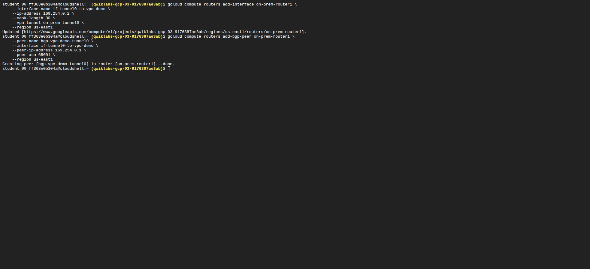

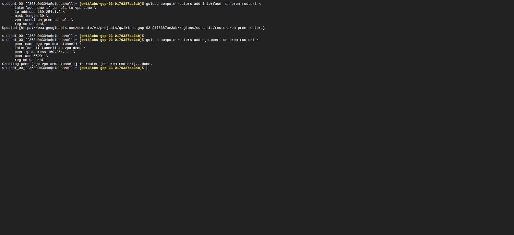

Verify VPN tunnels with BGP established:

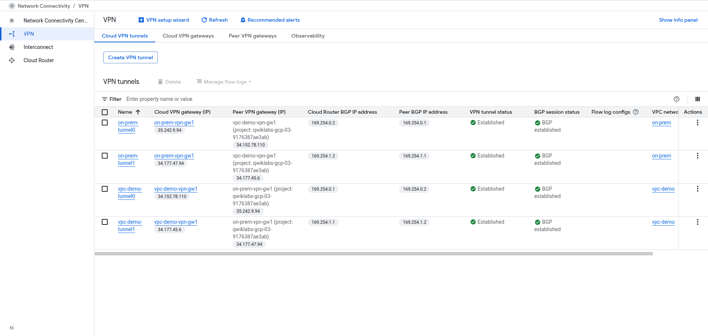

View Cloud Routers with active BGP sessions:

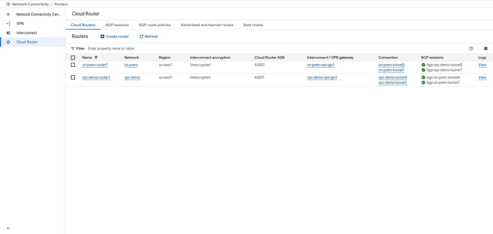

### 3.6 Verify Router Configurations

Describe the Cloud Routers to verify their settings:

```bash
gcloud compute routers describe vpc-demo-router1 --region "REGION 1"
gcloud compute routers describe on-prem-router1 --region "REGION 1"
```


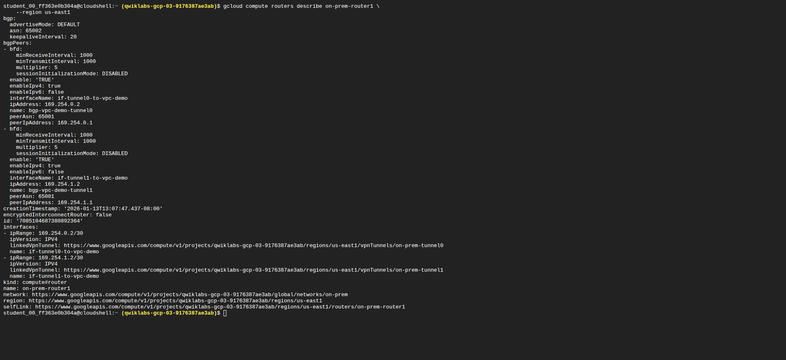

### 3.7 Configure Cross-VPC Firewall Rules

Allow traffic between the VPC networks:

```bash
# Allow traffic from on-prem to vpc-demo
gcloud compute firewall-rules create vpc-demo-allow-subnets-from-on-prem \
    --network vpc-demo \
    --allow tcp,udp,icmp \
    --source-ranges 192.168.1.0/24

# Allow traffic from vpc-demo to on-prem
gcloud compute firewall-rules create on-prem-allow-subnets-from-vpc-demo \
    --network on-prem \
    --allow tcp,udp,icmp \
    --source-ranges 10.1.1.0/24,10.2.1.0/24
```

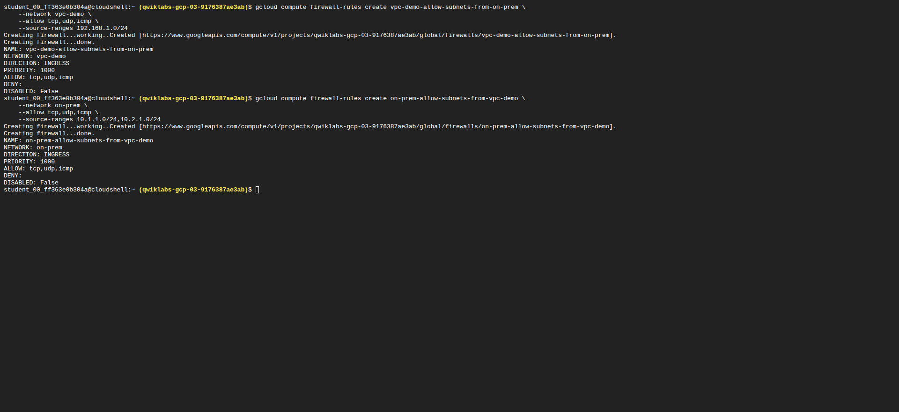

View firewall rules in the console:

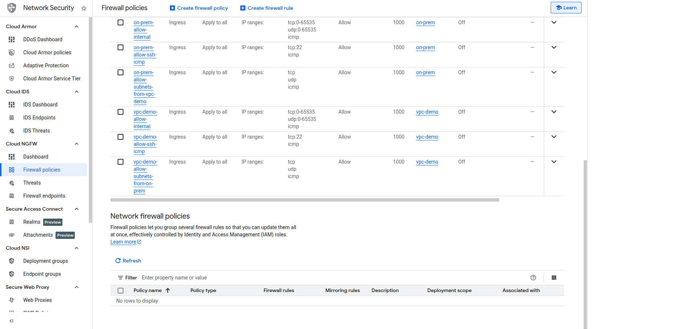

---

## Task 4: Verify VPN Connectivity

### 4.1 Verify Tunnel Status

List all VPN tunnels:

```bash
gcloud beta compute vpn-tunnels list
```

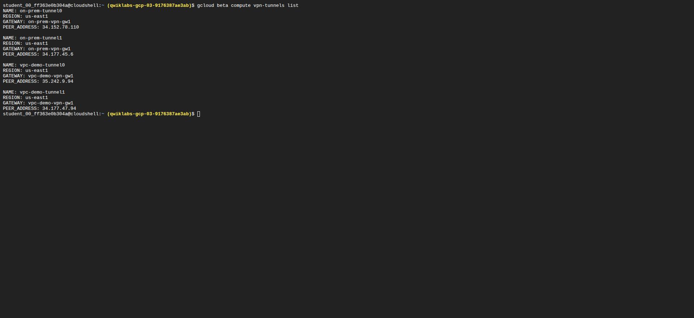

Describe individual tunnels to verify status:

```bash
gcloud beta compute vpn-tunnels describe vpc-demo-tunnel0 --region "REGION 1"
gcloud beta compute vpn-tunnels describe vpc-demo-tunnel1 --region "REGION 1"
```


```bash
gcloud beta compute vpn-tunnels describe on-prem-tunnel0 --region "REGION 1"
gcloud beta compute vpn-tunnels describe on-prem-tunnel1 --region "REGION 1"
```

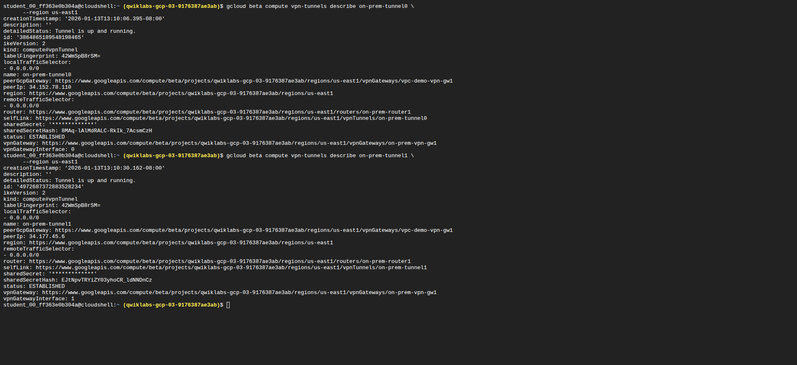

> **Expected Output**: `detailedStatus: Tunnel is up and running.`

### 4.2 Test Private Connectivity

SSH into the on-prem instance and test connectivity:

```bash
gcloud compute ssh on-prem-instance1 --zone "ZONE 1"
```

Ping the vpc-demo instance:

```bash
ping 10.1.1.2
```

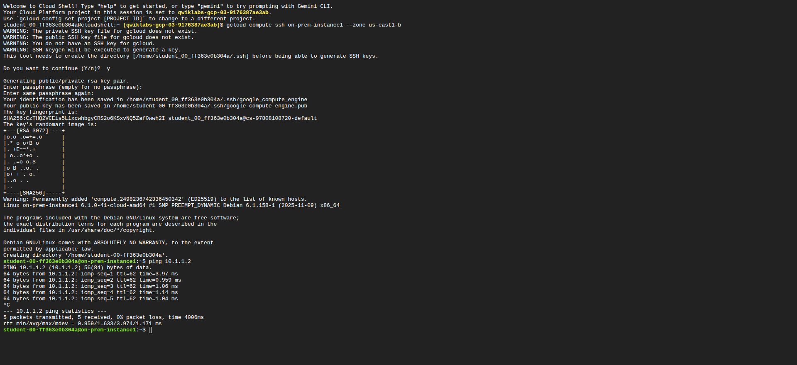

---

## Task 5: Global Routing with VPN

### 5.1 Enable Global Routing Mode

By default, Cloud Router only sees routes in its own region. Enable global routing to reach instances in other regions:

```bash
gcloud compute networks update vpc-demo --bgp-routing-mode GLOBAL
```

Verify the change:

```bash
gcloud compute networks describe vpc-demo
```

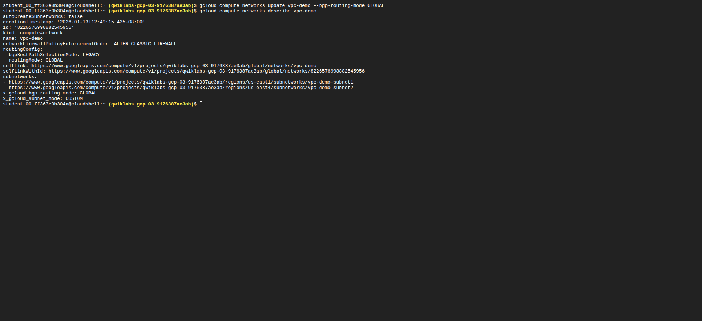

### 5.2 Test Cross-Region Connectivity

From the on-prem instance, ping the vpc-demo instance in Region 2:

```bash
ping 10.2.1.2
```

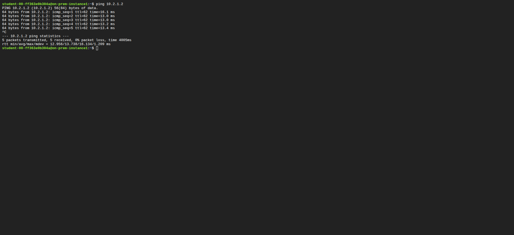

---

## Task 6: Verify High Availability

### 6.1 Test Tunnel Failover

Delete one tunnel to simulate a failure:

```bash
gcloud compute vpn-tunnels delete vpc-demo-tunnel0 --region "REGION 1"
```

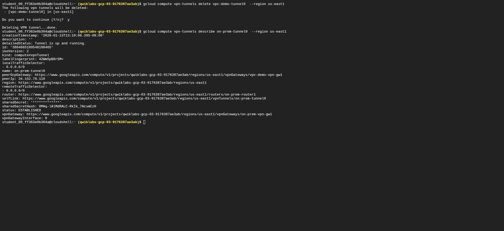

### 6.2 Verify Continued Connectivity

While the tunnel is down, verify that pings continue through the second tunnel:

```bash
ping 10.1.1.2
```

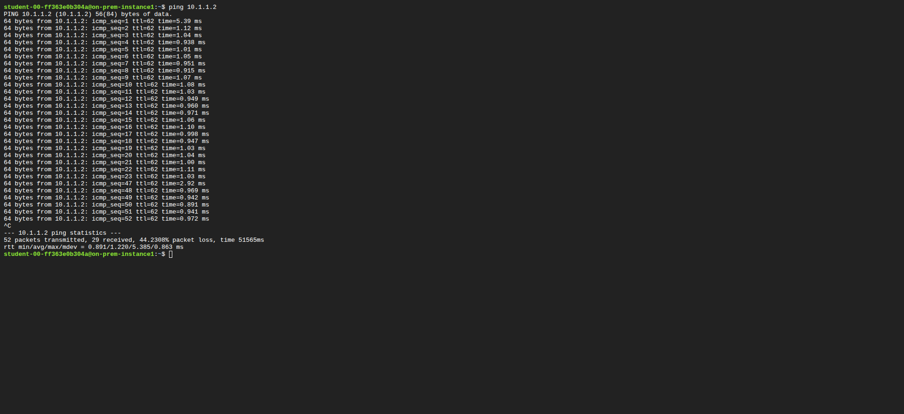

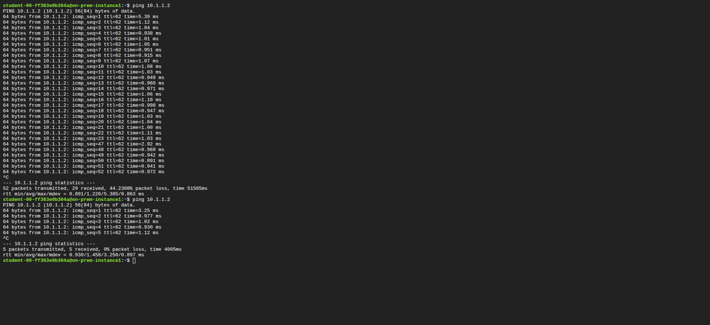

> **Result**: Traffic automatically fails over to the remaining tunnel, demonstrating HA-VPN high availability.

---

## Summary

In this lab, you successfully:

| Task | Description |
|------|-------------|
| ✅ Created VPC Networks | Set up `vpc-demo` and `on-prem` networks with subnets |
| ✅ Configured Firewall Rules | Allowed internal traffic and SSH/ICMP access |
| ✅ Deployed VM Instances | Created test instances in both networks |
| ✅ Created HA-VPN Gateways | Deployed HA-VPN gateways with two interfaces each |
| ✅ Configured Cloud Routers | Created routers with BGP ASN configuration |
| ✅ Established VPN Tunnels | Created two tunnels per gateway for 99.99% SLA |
| ✅ Configured BGP Peering | Set up dynamic routing between networks |
| ✅ Enabled Global Routing | Extended route visibility across regions |
| ✅ Verified High Availability | Confirmed automatic failover when a tunnel fails |

---

## Additional Resources

- [Cloud VPN Overview](https://cloud.google.com/vpn/docs/concepts/overview)
- [HA VPN Topologies](https://cloud.google.com/vpn/docs/concepts/topologies)
- [Cloud Router Overview](https://cloud.google.com/router/docs/concepts/overview)
- [BGP Best Practices](https://cloud.google.com/router/docs/concepts/best-practices)

## Links

Origin : 
- [Origin](https://github.com/andre4freelance/GCP-HA-VPN/)
- [Linkedin post]([https://github.com/andre4freelance/GCP-HA-VPN](https://www.linkedin.com/posts/link-andre-bastian_googlecloud-cloudnetworking-havpn-activity-7416981313884426240-P6J2?utm_source=share&utm_medium=member_desktop&rcm=ACoAAD73JlUBty-p-mBfMEW0-O4j0sv-e_PRQvc)/)
- [Facebook post]
